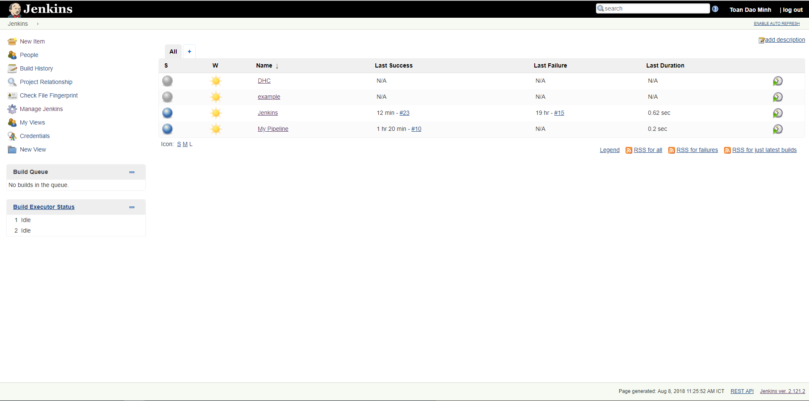
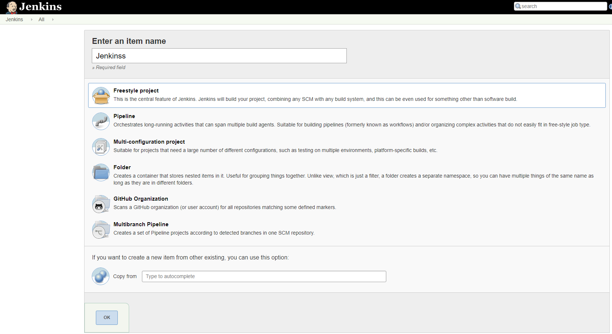
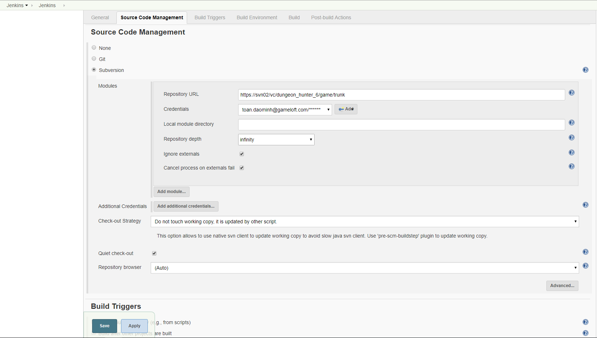
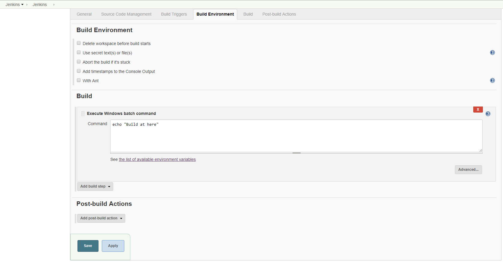
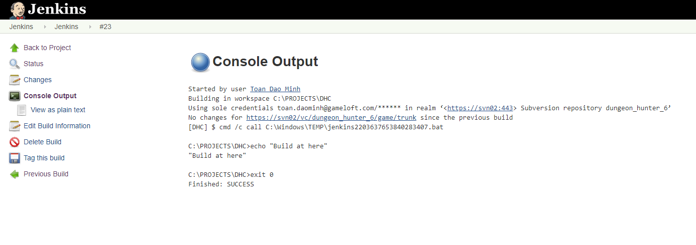
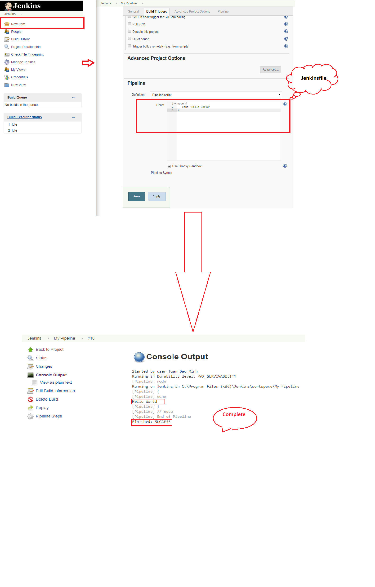

# Jenkins
## Jenkins - Overview
Jenkins is a software that allows **continuous integration**. Jenkins will be installed on a server where the central build will take place. The following flowchart demonstrates a very simple workflow of how Jenkins works.
## Jenkins - Installation
#### Download Jenkins
You can download Jenkins following link [Jenkins](https://jenkins.io)
#### Starting Jenkins
Open the command prompt. Browse to the directory where the jenkins.war file is present.
``` cpp
D:/> java -jar Jenkins.war
```
After the command is run, various tasks will run, one of which is the extraction of the war file which is done by an embedded webserver called winstone.</br>
```
D:\>Java –jar Jenkins.war
Running from: D:\jenkins.war
Webroot: $user.home/ .jenkins
Sep 29, 2015 4:10:46 PM winstone.Logger logInternal
INFO: Beginning extraction from war file
```
Once the processing is complete without major errors, the following line will come in the output of the command prompt.</br>
```
INFO: Jenkins is fully up and running
```


#### Accessing jenkins
Once jenkins is up and running, one can access jenkins from the link - **http://localhost:8080**</br>


## Create your firest Freestyle project
The build of a project is handled via jobs in Jenkins. Select New Item. Afterwards, enter a name for the job and select Freestype Job and press **OK**
</br>
Enter a description for the job and configure how many old jobs should be ratained.
</br>
Configure how the source code can be retrieved. If you for example using Git, enter the URL to the Git repository. If the repository is not public, you may also need to configure the credentials.</br>
</br>
I typically delete the workspace before a build to avoid any side-effect. In the Build section you can add a build step, e.g., Windows batch command

Press **Save** to finish the job definition. Press **Build Now** on the job page to validate the job works as expected.
</br>
After a while the job should go to green or blue (depending on your configuration), if successful. Click on the job and afterwards on Console Output to see the log file. Here you can analyze the build errors.</br>


## Creating your first Pepeline
#### What is a jenkins pipeline?
**Jenkins Pipeline** is a suite of plugin which support implementing and integrating continuous delivery pipeline into jenkins.</br>
To get started quickly with Pipeline:</br>

1. Copy one of the example below into your repository and name it **Jenkinsfile**.
2. Click the New item menu within Jenkins.
3. Provide a name for your new item(e.g **My Pipeline**) and select **Multibranch Pipeline**
4. Click the **Add Source** butto, choose the type of repository you want to use and fill in the details.
5. Click the Save button and watch your first Pipeline run!

## Cleaning up and notifications
Since the post section of a Pipeline is guaranteed to run at the end of a Pipeline’s execution, we can add some notification or other steps to perform finalization, notification, or other end-of-Pipeline tasks.</br>

Jenkinsfile(Declarative Pipeline)</br>

```
pipeline {
    agent any
    stages {
        stage('No-op') {
            steps {
                sh 'ls'
            }
        }
    }
    post {
        always {
            echo 'One way or another, I have finished'
            deleteDir() /* clean up our workspace */
        }
        success {
            echo 'I succeeeded!'
        }
        unstable {
            echo 'I am unstable :/'
        }
        failure {
            echo 'I failed :('
        }
        changed {
            echo 'Things were different before...'
        }
    }
}
```
Example for **Email**:
```
post {
    failure {
        mail to: 'team@example.com',
             subject: "Failed Pipeline: ${currentBuild.fullDisplayName}",
             body: "Something is wrong with ${env.BUILD_URL}"
    }
}
```
